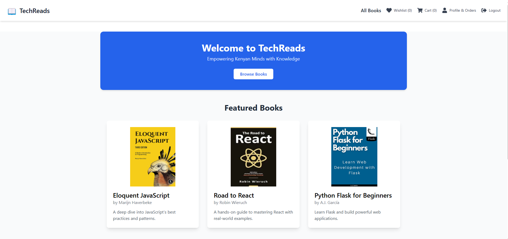

# TechReads app
This is an app designed for finding books that deal with topics such as technology, engineering and other technical fields.

This app was a collaborative effort between our fellow classmates listen below:
- Nursamedin Abdi Dualle
- Dennis Kemboi 
- Yakubu Esuza
- Mary Gichana

## Description
This app lets you find various books that cover many topics in the technological field, it was made using React for the frontend and Flask for the backend. Users can browse, view, and purchase books from this website.

## Screenshot

## Features
- Allows a user to make an account in order to purchase books.
- Displays all books to the user.
- Allows users the add books to their cart in order to check out and purchase.
- Allows users to add books to their wishlists.

## How to use

### Requirements
- A computer.
- Access to the internet.
- A web browser.

Live link for the frontend: `https://techreadsafrica.netlify.app/`
Live link for the backend:  `https://techreads-backend.onrender.com/`
Backend repository link      `https://github.com/Denkogei/TechReads-backend`

## Local deployment
To run the project locally, one will need:
- A basic understanding of how React and Flask work.
- A code editor (preferably VS Code).
- Python and pip for your backend dependencies.

## Frontend Installation
1. Clone this repository by clicking on the SSH and then copy the link `https://github.com/Denkogei/TechReads-frontend`
2. Open your terminal and enter git clone `git@github.com:Denkogei/TechReads-frontend.git`
3. Enter cd and the name of the file.
4. Run npm install then npm run dev to download your dependencies and run the local server.

## Backend Installation
1. Clone this repository by clicking on the SSH and then copy the link `https://github.com/Denkogei/TechReads-backend`
2. Open your terminal and enter git clone `git@github.com:Denkogei/TechReads-backend.git`
3. Enter cd and the name of the file.
4. Run pipenv install and pipenv shell to download your backend dependencies and enter your virtual enviroment.
5. To run the flask application, type `flask run` in your terminal.

## Contacts
Below you can find the contacts of the people who worked on this incase you need support
- denkogei11@gmail.com
- nursamedin.a.dualle@gmail.com
- yakubuesuza@gmail.com
- marygichana95@gmail.com

# License
MIT License

Copyright © 2025 Nursamedin Dualle, Dennis Kemboi, Yakubu Esuza, Mary Gichana

Permission is hereby granted, free of charge, to any person obtaining a copy of this software and associated documentation files (the "Software"), to deal in the Software without restriction, including without limitation the rights to use, copy, modify, merge, publish, distribute, sublicense, and/or sell copies of the Software, and to permit persons to whom the Software is furnished to do so, subject to the following conditions:

The above copyright notice and this permission notice shall be included in all copies or substantial portions of the Software.

THE SOFTWARE IS PROVIDED "AS IS", WITHOUT WARRANTY OF ANY KIND, EXPRESS OR IMPLIED, INCLUDING BUT NOT LIMITED TO THE WARRANTIES OF MERCHANTABILITY, FITNESS FOR A PARTICULAR PURPOSE AND NONINFRINGEMENT. IN NO EVENT SHALL THE AUTHORS OR COPYRIGHT HOLDERS BE LIABLE FOR ANY CLAIM, DAMAGES OR OTHER LIABILITY, WHETHER IN AN ACTION OF CONTRACT, TORT OR OTHERWISE, ARISING FROM, OUT OF OR IN CONNECTION WITH THE SOFTWARE OR THE USE OR OTHER DEALINGS IN THE SOFTWARE.
